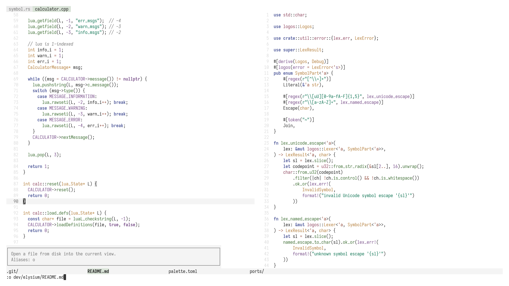

# elysium
elysium is a neutral, muted light theme. It is currently a work in progress.

# preview

# ports
- editors
  - [helix](https://github.com/Apeiros-46B/elysium/tree/main/ports/helix)
- miscellaneous
  - [base16](https://github.com/Apeiros-46B/elysium/tree/main/ports/base16)

# design philosophy
1. Background and foreground tones should be neutral. It should be up to the user to alter temperature through a global program like [redshift](https://github.com/jonls/redshift).
2. The other colors should be around the same luminance (oklch) as each other and be slightly muted. They should be desaturated, but have just the right amount of contrast where they're still distinguishable from each other and easy to read from the background tones.

# palette
Foreground and background shades are still temporary at this point and you can basically just replace them with any neutral gray tones if you prefer.

|name      |hex      |original definition             |meaning                                                                                   |
|----------|---------|--------------------------------|------------------------------------------------------------------------------------------|
|bg0       |`#ffffff`|hex                             |primary background                                                                        |
|bg1       |`#f4f4f4`|hex                             |secondary background, current line, unfocused statusline                                  |
|bg2       |`#ebebeb`|hex                             |tertiary background, focused statusline                                                   |
|bg3       |`#e4e4e4`|hex                             |TBD                                                                                       |
|bg4       |`#dfdfdf`|hex                             |TBD                                                                                       |
|bg5       |`#dcdcdc`|hex                             |TBD                                                                                       |
|fg0       |`#333333`|hex                             |primary foreground                                                                        |
|fg1       |`#202020`|hex                             |strong foreground                                                                         |
|fg2       |`#000000`|hex                             |strong foreground                                                                         |
|fg3       |`#777777`|hex                             |weak foreground, comments, statusline text                                                |
|fg4       |`#888888`|hex                             |faded foreground, unimportant information                                                 |
|red       |`#904961`|`oklch(50% 0.1 0)`              |errors, namespaces, fields, diff deleted, breakpoint, semantic comment                    |
|orange    |`#934c3d`|`oklch(50% 0.1 33)`             |operators, labels (for goto, switch), storage classifiers (const/mut)                     |
|yellow    |`#b5803e`|`oklch(64% 0.105 70)`           |warnings, type names, escape sequences, debugger paused, jump/hop label                   |
|green     |`#427138`|`oklch(50% 0.1 140)`            |functions/methods, diff inserted, todos                                                   |
|aqua      |`#117555`|`oklch(50% 0.1 165)`            |info, string literals, character literals,                                                |
|blue      |`#535d9c`|`oklch(50% 0.1 275)`            |hints, keywords, diff modified                                                            |
|purple    |`#79508a`|`oklch(50% 0.1 315)`            |numeric literals, boolean literals, macros, preprocessor directives, constants            |
|bg\_red   |`#e9dbdf`|20% opacity red on top of bg0   |diff deleted (background)                                                                 |
|bg\_orange|`#e9dbd8`|20% opacity orange on top of bg0|TBD                                                                                       |
|bg\_yellow|`#f0e6d8`|20% opacity yellow on top of bg0|debugger paused (background), jump/hop label (background)                                 |
|bg\_green |`#d9e3d7`|20% opacity green on top of bg0 |diff inserted (background)                                                                |
|bg\_aqua  |`#cfe3dd`|20% opacity aqua on top of bg0  |text search result (background)                                                           |
|bg\_blue  |`#dddfeb`|20% opacity blue on top of bg0  |menus/list selection (background), diff modified (background)                             |
|bg\_purple|`#e4dce8`|20% opacity purple on top of bg0|selection (text)                                                                          |

# FAQ
- Q: Dark mode?  
  A: This is not planned, but if you like elysium, you may like [Paradise](https://github.com/paradise-theme/paradise) and [Mountain](https://github.com/mountain-theme/Mountain).
