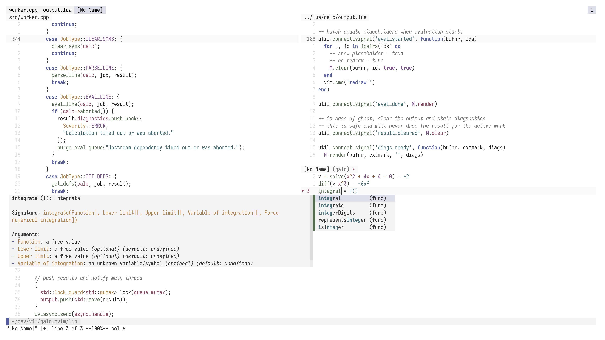

# elysium
elysium is a neutral, muted light theme.

# preview

# ports
- editors
  - [vim/neovim](https://github.com/Apeiros-46B/elysium/tree/main/ports/vim)
  - [helix](https://github.com/Apeiros-46B/elysium/tree/main/ports/helix)
- miscellaneous
  - [base16](https://github.com/Apeiros-46B/elysium/tree/main/ports/base16)

# design philosophy
1. Background and foreground tones should be neutral. It should be up to the user to alter temperature through a global program like [redshift](https://github.com/jonls/redshift).
2. The other colors should be around the same luminance (oklch) as each other and be slightly muted. They should be desaturated, but have just the right amount of contrast where they're still distinguishable from each other and easy to read from the background tones.

# palette
| name       | hex       | original definition                 | meaning                                                                                    |
| ---------- | --------- | ---------------------------------   | ------------------------------------------------------------------------------------------ |
| bg0        | `#ffffff` | hex                                 | primary background                                                                         |
| bg1        | `#f4f4f4` | hex                                 | secondary background, unfocused statusline                                                 |
| bg2        | `#ebebeb` | hex                                 | tertiary background, focused statusline                                                    |
| bg3        | `#e4e4e4` | hex                                 | (unassigned)                                                                               |
| bg4        | `#dfdfdf` | hex                                 | (unassigned)                                                                               |
| bg5        | `#dcdcdc` | hex                                 | (unassigned)                                                                               |
| bg_cursor  | `#fafafa` | hex                                 | current line, current column, sidebar panel                                                |
| fg0        | `#333333` | hex                                 | primary foreground                                                                         |
| fg1        | `#202020` | hex                                 | strong foreground                                                                          |
| fg2        | `#000000` | hex                                 | strong foreground                                                                          |
| fg3        | `#777777` | hex                                 | weak foreground, comments, statusline text                                                 |
| red        | `#904961` | `oklch(50% 0.1 0)`                  | errors, namespaces, fields, diff deleted, breakpoint, semantic comment                     |
| orange     | `#90502a` | `oklch(50% 0.1 50)`                 | operators, labels (for goto, switch), storage classifiers (const/mut)                      |
| yellow     | `#b38143` | `oklch(64% 0.1 70)`                 | warnings, type names, escape sequences, debugger paused, jump/hop label                    |
| green      | `#546b4f` | `oklch(50% 0.05 140)`               | functions/methods, diff inserted, todos                                                    |
| aqua       | `#406b75` | `oklch(50% 0.05 215)`               | info, string literals, character literals, text search result (background, focused)        |
| blue       | `#535d9c` | `oklch(50% 0.1 275)`                | hints, keywords, diff modified                                                             |
| purple     | `#79508a` | `oklch(50% 0.1 315)`                | numeric literals, boolean literals, macros, preprocessor directives, constants             |
| bg\_red    | `#e9dbdf` | 20% opacity red on top of bg0       | diff deleted (background)                                                                  |
| bg\_orange | `#e9dcd4` | 20% opacity orange on top of bg0    | (unassigned)                                                                               |
| bg\_yellow | `#f0e6d9` | 20% opacity yellow on top of bg0    | debugger paused (background), jump/hop label (background)                                  |
| bg\_green  | `#dce2da` | 20% opacity green[^1] on top of bg0 | diff inserted (background)                                                                 |
| bg\_aqua   | `#d5e2e5` | 20% opacity aqua[^2] on top of bg0  | text search result (background)                                                            |
| bg\_blue   | `#dddfeb` | 20% opacity blue on top of bg0      | active item in menus (background), diff modified (background)                              |
| bg\_purple | `#e4dce8` | 20% opacity purple on top of bg0    | selection (text)                                                                           |

[^1]: green with 0.07 chroma (`oklch(50% 0.07 140)`)
[^2]: aqua with 0.07 chroma (`oklch(50% 0.07 215)`)

# FAQ
- Q: Dark mode?  
  A: I will not be making a dark variant of elysium, but you might like [Paradise](https://github.com/paradise-theme/paradise) or [Mountain](https://github.com/mountain-theme/Mountain).
